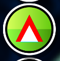

# Level Comparison (beta)

Create your own level comparisons by using the menu button on the level page!

## Features
- Set ID of level to be compared to
- Select buffed/nerfed role
- Set saw rotation speed
- Create the level

## Upcoming features
- Toggle remapping groups and triggers (until then use build helper)
- Toggle hide invisible
- Toggle replace black objects
- Toggle show D-blocks etc.
- Multi platform support

## How to use
- Go to any online level
- Find the mod button on the left menu

Unfortunately you can only compare two online levels, as I am still thinking of a way to make it more flexible.
## Special thanks
... to [LeTim [GD]](https://www.youtube.com/@LeTim) for the idea to build the mod!

## Note
This mod is still in development so bug can still occur. Feel free to report them by creating an Issue on Github.

Also this is my first Geode mod :D